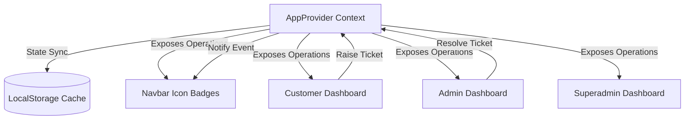

# Chovique Luxury Chocolates - Frontend Architecture & User Flows

This document details the frontend implementation, user flows, and features added to the Chovique application for Customer support, address management, notifications, profiles, and administration settings.

---

## 🗺️ Architectural Flow Overview

The diagram below outlines how the components interact through the global state provider:



---

## 🔑 Primary User Flows

### 1. Help & Customer Support Flow
* **Filing a Complaint**:
  * Customers navigate to the **Help & Complaints** tab inside their dashboard.
  * They select from default categories (*Chocolate melted*, *Slow delivery*, *Return order not accepting*, *Refund not debited*, or *Other*) and detail the issue in a text field.
  * Submission triggers `addSupportTicket`, saving it to context and `localStorage` with `status: 'Pending'`.
* **Resolution Ledger (Admin)**:
  * Admins navigate to the **Customer Complaints** sidebar workspace.
  * Selecting a pending ticket opens the resolution notes form.
  * Submitting notes calls `resolveSupportTicket`, updating ticket status and adding an alert to the customer's notifications list.
* **Resolution Verification (Customer)**:
  * Resolved notifications display on the Customer Overview page: *"Admin resolved your issue: [notes]. Was this resolved to your satisfaction?"*
  * Customer submits interactive feedback (*Yes, Resolved* or *No, Still Broken*), closing the alert.

### 2. Custom Profile & Upload Flow
* **Avatar Upload**:
  * Customers open the **My Profile** tab, select an image file, which is converted to a base64 data-URI, and trigger `updateUserProfilePicture`.
  * The image is cached globally and displays as their profile avatar.
* **Admin Verification**:
  * Admins inspecting customer directories see the customer's custom profile picture next to their transaction list and profile cards.

### 3. Shipping Address Book Flow
* **List & Default Toggles**:
  * Customers open the **Addresses** tab showing current billing/shipping locations.
  * Toggling "Set as Default" triggers `setDefaultAddress`, shifting the primary target indicator and clearing default designations on all other addresses.
* **Addition & Removal**:
  * Forms allow adding new address coordinates (Street, City, State, ZIP, Phone).
  * Previous addresses can be deleted using confirmation triggers.

### 4. Global Activity Alerts & Navbar Notifications
* **Notification Queue**:
  * Actions (e.g., placing an order, ticket resolutions) push alerts into the global `notifications` array.
* **Navbar Interaction**:
  * The customer navbar displays a permanent red badge showing active notification count.
  * Clicking the bell displays a dropdown popover.
  * Selecting an alert calls `removeNotification` (dismissing it) and redirects the router to the relevant tab (e.g., Help tab for tickets, Orders tab for logistics).

### 5. Superadmin Platform Settings Flow
* **System Settings Configuration**:
  * Superadmins navigate to **Platform Settings** containing three cards:
    1. *Store Configuration*: Store Front Name, Customer Support Email/Phone.
    2. *Payment & Shipping*: Enable COD toggle, Free shipping min threshold (₹).
    3. *System Security*: Maintenance mode toggle, signup block, and session idle timeout sliders.
  * Edits save directly to `localStorage`, logging settings adjustments in the audit ledger.

---

## 🛠️ Verification & Building
To check typescript type-safety and ensure no compilation regressions exist, execute:
```bash
npx tsc -p tsconfig.app.json --noEmit
```
To run the local development server:
```bash
npm run dev
```
